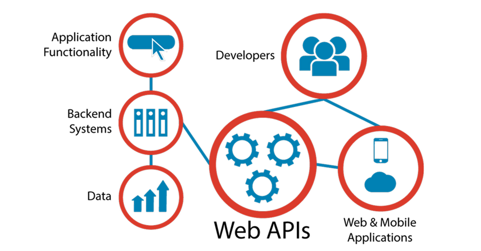

API endpoint

What?  
- Khái niệm: "Application Programing Interface"
    - tập hợp các quy tắc cho phép phần mềm ứng dụng khác nhau giao tiếp và làm việc cùng nhau
    - API cho phép các ứng dụng truy cập vào tính năng và dữ liệu của ứng dụng, hệ thống khác một cách an toàn mà không cần phai biết quy trình hoạt động của chúng. 

- Định nghĩa: là URL hoặc đường dẫn mà ứng dụng dùng để giao tiếp với một API(Application Programing Interface). Đây là nơi request và response của API diễn ra.

