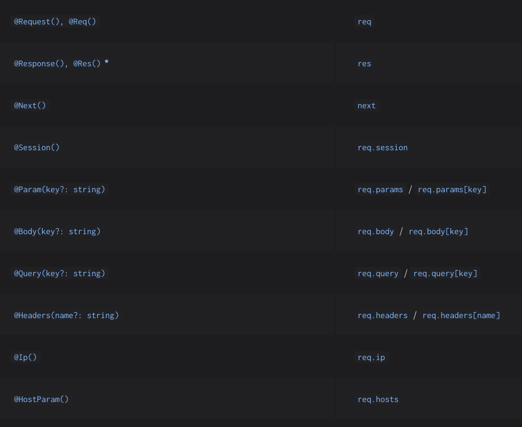

# Controller trong NestJS

1. **Controller là gì?**
   - Controller trong NestJS chịu trách nhiệm xử lý các yêu cầu (requests) từ client và trả về phản hồi (responses).
   - Nó giống như "cầu nối" giữa client và logic xử lý của ứng dụng.
   - NestJS định tuyến (routing) các yêu cầu đến đúng controller dựa vào đường dẫn (path) và HTTP method (GET, POST, PUT, DELETE, v.v.).

2. **Decorator @Controller()**
   - `@Controller()` là một decorator để khai báo một controller.
   - Bạn có thể thêm một prefix vào controller để nhóm các route liên quan. Ví dụ:

   ```typescript
   @Controller('cats')

   Điều này nghĩa là mọi route trong controller này sẽ bắt đầu với /cats.
3. **Ví dụ về Controller**

    ```typescript
    import { Controller, Get } from '@nestjs/common';

    @Controller('cats') // Định nghĩa prefix là 'cats'
    export class CatsController {
        @Get() // Lắng nghe HTTP GET request tại endpoint '/cats'
        findAll(): string {
            return 'This action returns all cats';
        }

         @Get('breed') // Lắng nghe GET /cats/breed
        findByBreed(): string {
            return 'This action returns cats by breed';
        }
    }
### Giải thích:

- `Controller('cats')`: Định nghĩa prerfix `/cats` cho controller này.
- `@Get()`: Lắng nghe các HTTP GET requests tại `/cats`.
- `findAll()`: Phương thức này được gọi khi có GET request đến `/cats`.

Khi gửi GET request đến `http://localhost:3000/cats`:

- `findAll()` sẽ chạy và trả về chuỗi **"This action returns all cats"**.

4. **Tạo Controller nhanh với CLI**
Bạn có thể tạo một controller nhanh chóng bằng lệnh

    ```typescript 
    $ nest g controller [name]
    ```
    
    Ví dụ:
    ```typescript 
    $ nest g controller catsz
    Lệnh này sẽ tự động tạo file cats.controller.ts với cấu trúc cơ bản.
    ```
5. ***Định tuyến trong Controller***
- Cách Nest xác định route(endpoint)
    - Prefix của controller (ví dụ: `/cats`)
    - Path trong decorator HTTP method (ví dụ: `@Get('bread')`)
- Ví dụ: 
    ```typescript 
    import { Controller, Get } from '@nestjs/common';

    @Controller('cats')
    export class CatsController {
        @Get() // Lắng nghe GET /cats
        findAll(): string {
            return 'This action returns all cats';
        }

        @Get('breed') // Lắng nghe GET /cats/breed
        findByBreed(): string {
        return 'This action returns cats by breed';
        }
    }
    ```
- Kết quả: 
    - `GET /cats`: → gọi `findAll()`.
    - `GET /cats/breed` → gọi `findByBreed()`

- Điều này có nghĩa là khi một yêu cầu Get được gửi đến endpoint `/cats`, NestJS sẽ chuyển hướng yêu cầu đó tới phướng thức `findAll()` mà bạn đã định nghĩa trong controller của mình.
- Tên phương thức ( `findAll()` trong ví dụ này ) là tuỳ ý, có thể đặt bất kỳ tên nào bạn muốn. NestJS không quan tâm đến tên phương thức, miễn là phương thức đó được khai báo đúng cách và ánh xạ với route thông qua decorator (ví dụ: `Get()`) 
- Điều này có nghĩa là khi bạn khai báo một phương thức ánh xạ (bind) với route, nhưng NestJS không sử dụng tên của phương thức để thực hiện logic đặc biệt, vì vậy bạn có thể chọn bất kỳ tên nào.
- Khi bạn gọi phương thức `findAll()`, phương thức này sẽ trả về mã status 200(có nghĩa là yêu cầu thành công) và một phản hồi kèm theo, ở đây là một chuỗi văn bản đơn giản: `"This action returns all cats"`.
- *"Tại sao điều đó lại xảy ra? Để giải thích, chúng ta sẽ đầu tiên giới thiệu khái niệm rằng Nest sử dụng hai phương pháp khác nhau để thao tác với các phản hồi:"*

    -   Standard( <span style="color:red">recommended</span> ): 
        - Trong phương pháp này, khi một **request handler** (phương thức xử lý yêu cầu) trả về một `đối tượng Javascipt` hoặc `mảng`, 
        NestJS sẽ tự động `serialize (chuyển đổi)` chúng thành `JSON`. Điều này có nghĩa là bạn chỉ cần trả về `object` || `array`. 
        Nest sẽ tự động thực hiện chuyển đổi và gửi laaij phản hồi dứoi dạng `JSON`.
            - Với kiểu dữ liệu `primitive`(ví dụ: string, number, boolean), Nest sẽ gửi giá trị đơn giản mà không cần thực hiện bất kỳ thao tác `serialize` nào.
                - Ví dụ: Nếu phương thức trả về một chuỗi "Hello", Nest sẽ gửi "Hello" mà không cần thực hiện bất kỳ phương thức chuyển dổi nào.
            - Mã trạng thái `(Status Code)`: Mã trạng thái mặc định là 200 đối với tất cả các yêu cầu, ngoại trừ các yêu cầu POST, nơi mà Nest mặc định trả về 201(Created). Bạn có thể thay đổi `status code` bằng cách sử dụng `@HttpCode()` decorator tại cấp độ phương thức ( ví dụ: `@HttpCode(201)` )
    -   Library-specific 
        - Phương pháp này cho phép bạn sử dụng đối tương phản hồi đặc thù của thư viện mà bạn đang sử dụng, ví dụ: `Express` trong NestJS. Bạn có thể inject đối tượng phản hồi vào phương thức handler thông qua decorator @Res()
        - Cách thức sử dụng: 
            - Bạn có thể sư dụng dối tương phản hồi đặc thù (như dối tượng response của `Express`) để tuỳ chỉnh và sử lý phản hồi chi tiết hơn.
            - Ví dụ: Nếu bạn đang sử dụng `Express`, bạn có thể trả về response với status code và nội dung như sau:
                ```typescript 
                response.status(200).send({message: "Success"});
                ```
        - Lợi ích: Phương pháp này cho phép bạn có sự kiểm soát linh hoạt hơn đối với phản hồi, chẳng hạn như tuỳ chỉnh status code, thêm tittle HTTP, hoặc thực hiện các thao tác phức tạp với response.

    ``` 
    - Standard ( recommanded ): NestJS tự động xử lý việc `serialize` && `response` với status code 200 (hoặc 201 cho POST). Bạn chỉ cần trả về giá trị.
    - Library-specific: Sử dụng đôi tượng phản hồi đặc thù của thư viện (như `Express`) cho phép bạn tuỳ chỉnh phản hồi chi tiết hơn.
    ``` 


## Warning

Nest phát hiện khi trình xử lý (handler) sử dụng `@Res()` hoặc `@Next()`, điều này cho thấy bạn đã chọn cách tiếp cận cụ thể theo thư viện.

Nếu cả hai cách tiếp cận được sử dụng cùng lúc, **Standard approach** sẽ tự động bị vô hiệu hóa cho route đó và sẽ không hoạt động như mong đợi.

Để sử dụng cả hai cách tiếp cận cùng lúc (ví dụ: chỉ inject đối tượng response để thiết lập cookies/headers nhưng vẫn để framework xử lý phần còn lại), bạn cần đặt tùy chọn `passthrough` thành `true` trong decorator `@Res({ passthrough: true })`.

### Ví dụ

```typescript
import { Controller, Get, Res } from '@nestjs/common';
import { Response } from 'express';

@Controller('example')
export class ExampleController {
  @Get()
  handleRequest(@Res({ passthrough: true }) res: Response): string {
    res.cookie('key', 'value'); // Thiết lập cookie
    return 'Phản hồi được xử lý bởi framework'; // Phản hồi tiêu chuẩn
  }
}
```

# Request object 

- Trong NestJS, bạn có thể inject `request object` (Express by default) vào một phương thức xử lý (handler) bằng cách sử dụng `@Req()` decorator.
Điều này cho phép bạn thao tác trực tiếp với yêu cầu HTTP.

- Ví dụ minh hoạ: 
    ```typescript
    import {Controller} from "@nestjs/common"
    import {Request} from "express" // Express request object

    @Controller('cats')
    export class CatsController {
        @Get()
        findAll(@Req() request: Request): string {
            console.log(request.headers) // Lấy headers của request
            return 'This action returns all cats';
        }
    }
    ```
    - Giải thích ví dụ: 
    1. `@Req()` decorator: 
        - Chỉ định rằng bạn muốn inject đối tượng `request` từ Express vào phương thức `findAll`
    2. Đối tượng `request`: 
        - Đây là Express request object, chứa tất cả thông tin về yêu cầu từ client, ví dụ: 
            - `request.headers` để lấy thông tin tiêu đề HTTP.
            - `request.query` để lấy các query parameters.
            - `request.body` để lấy các dữ liệu trong phần body của yêu cầu (chỉ cho các phương thức POST/PUT).
            - `request.params` để lấy các tham số trong URL.
    3. Sử dụng:
    - Trong ví dụ này, chúng ta in ra console phần headers của yêu cầu HTTP. Khi client gửi một GET request đến `/cats`, bạn sẽ thấy headers được log trong console.

- Để tận dụng typings(kiểu dữ liệu) của Express trong Typescript, như ví dụ: `request: Request`, bạn cần cài đặt gói types/express.
    ### Câu này giải thích về đối tượng `request` trong NestJS và cách làm việc với nó khi xử lý các yêu cầu HTTP.

    1. Đối tượng `request` trong HTTP:
        - `request` đại diện cho yêu cầu HTTP được gửi tới server.
        - Nó chứa các thông tin quan trọng như:
            - `Query string`: tham số nằm trong URL (vd: `/users?id=123`).    
            - `Parameters`: tham số URL động (vd: `users/:id`).  
            - `HTTP headers`: thông tin meta của yêu cầu (ví dụ: `Content-Type`, `Authorization`).
            - `Body`: Dữ liệu được gửi từ client(vd: trrong POST request)
    2. Không cần truy cập vào các thuộc tính của `request`:
        - NestJS cung cấp các decorator để lấy data cụ thể từ request HTTP một cách dễ dàng.
        - Ví dụ: Thay vì thao tác `req.body`, bạn chỉ cần dùng @Body để lấy nội dung body của yêu cầu.
    3. Decorators được cung cấp sẵn trong NestJS: NestJS cung cấp các decorator như: 
        - `@Body()` để lấy body của request.
        - `@Query()` để lấy query string.
        - `@Param()` để lấy tham số trong URL.
        - `@Headers()` để lấy header của yêu cầu.
    4. Ví dụ cụ thể: 
        ```typescript
            import {Controller, } from "@nestjs/common"

            @Controller()
            export class UsersController {
                // Lấy query string từ URL (vd: /users?name=Jone)
                @Get()
                findUser(@Query('name') name: string): string {
                    return `User: ${name}`
                }

                // Lấy body từ POST request
                @POST()
                createUser(@Body() body:any ): string {
                    return `Creating user: ${JSON.stringify(body)}`;
                }

                // Lấy tham số động, từ URL (vd: /users/:id)
                @Get(:id)
                getUserById(@Param('id') id: string ): string { 
                    return `User ID: ${id}`;
                }
            }   
        ```
        - Khi có một GET request đến `users?name=Jone`, phương thức `findUser()` sẽ tự dộng nhận giá trị `name`.
        - Với POST request có body, `@Body()` sẽ lấy nội dung body mà không cần thao tác `req.body` thủ công.

    5. Tóm lại:
        - NestJS khuyến khích sử dụng decorators như `@Body()`, `@Query()`, `@Param()` để làm viêc với các phần của yêu cầu HTTP.
        - Điều này giúp mã gọn gàng, dễ đọc hơn và tích hợp tốt với hệ thống Typescript.   

             

# Resources                 

```typescript
    import {Controllers, Get, Post} from "@nesjs/common"

    @Controllers('cats')
    export class CatsController { 
        @Post()
        create(): string {
            return `This action adds a new cat`
        }   
    }
``` 

# Route wildcards

- Sử dụng các route đặc biệt như `(*)` để tạo các route có tính linh hoạt.
- cho phép match với nhiều URL khác nhau mà không cần phải định nghĩa từng route cụ thể.

`=> đây là cách sử dụng URL động, hoặc không biết trước các URL cụ thể.`

```typescript
    @Get('ab*cd')
    findAll() {
        return 'This route use a wildcard';
    } 
``` 

- Route này định nghĩa gì? 
    - Bất kỳ URL nào bắt đầu bằng `ab` và kết thúc bằng `cd` sẽ match với route này.
    - Phần ở giữa `*` có thể là bất kỳ chuỗi ký tự nào.
- URL sẽ match với route này:
    - `/abcd` (giữa `ab` và `cd` không có gì)
    - `/ab_cd` (dấu gạch dưới ở giữa)
    - `/abanythingcd` (bất kỳ chuỗi nào giữa `ab` và `cd`)
    - `/ab123cd`, `/ab-test-cd` cũng đều được.

- ## Ký tự đặc biệt khác có thể dùng 
    #### 1. `*`-Match với bất kỳ chuỗi nào.
    - Ví dụ: `ab*cd` match với `/abcd`, `/ab123cd`.
    #### 2. `?`-Match với một ký tự bất kỳ.
    - Ví dụ: `ab?cd` match với `/abacd`, `abbcd` (chỉ 1 ký tự ở giữa `ab` và `cd`).
    #### 3. `+`-Match với ít nhất một ký tự.
    - Ví dụ: `ab+cd` match với `/abxcd`, `ab123cd`, (phải có ít nhất 1 ký tự ở giữa `ab` và `cd`).
    #### 4. `()`-Để nhóm các phần tử của route.
    - Ví dụ: `ab(cd)?e` match với `/abe` (không có `cd`) hoặc `/abcde` (có `cd`).
    #### 5. `-` và `.`-Được hiểu theo nghĩa literal (không có ý nghĩa đặc biệt).
    - Ví dụ: `ab-cd` chỉ match với `/ab-cd` (phải có dấu gạch ngang)

- ## Hạn chế:
- #### Chỉ hỗ trợ trên Express: 
    - Wildcard ở giữa route `(ab*cd)` chỉ hoạt động nếu bạn dùng Express làm HTTP adapter trong NestJS.
    - Nếu bạn dùng `Fastify`, cách này sẽ không hoạt động.

- ## Khi nào dùng wildcard:
    - Khi bạn muốn match nhiều URL tương tự nhau, ví dụ: 
        - Tìm các sản phẩm có đường dẫn động `/products/*`
        - Match các URL không biết trước cụ thể.    
    
    ```typescript
        @Get('products/*')
        findProducts() {
            return 'This match any product URL';
        }
    ```

   #### URL: `/products/item1`, `/products/category/electronics` đều sẽ match với route này.

# Status Code

1. Default Status Code:
    - 200 (OK): Được sử dụng mặc định cho các request (`GET, DELETE, PUT, ...`)
    - 201 (Created): Mặc định cho `POST` request.
2. Tuỳ chỉnh Status Code: 
    - Sử dụng `HttpCode(...)` để thay đổi status code response cho từng handler.

    ```typescript
        @Post()
        @HttpCode(204) // Đặt Status code là 204 (No Content)
        create() {
            return 'This action adds a new cat'
        }
    ```

    - Khi gọi API này: 
        - `Status code response`: 204
        - `Body response`: vì mã `204` được dùng để chỉ ra rằng không có dữ liệu nào trả về.
    
3. `Status code phụ thuộc vào điều kiện`:
    - Trong một số trường hợp, `status code` của API không cố định, mà phụ thuộc vào logic/ kết quả xử lý.
    Bạn có thể sử dụng đối tượng response của framework (ví dụ: `@Res()` với Express) để tuỳ chỉnh `status code` dựa theo điều kiện.

    ```typescript
        Ví dụ đơn giản: 
            - Nếu bạn success response 201 (Created).
            - Nếu xảy ra lỗi dữ liệu không hợp lệ, response 400 bad request.
    ```

    ### Code minh hoạ 
    ```typescript 
        import { Controller, Post, Res } from '@nestjs/common';
        import { Response } from 'express';

        @Controller('cats')
        export class CatsController {
            @Post()
            create(@Res() res: Response) {
                const isCreated = Math.random() > 0.5; // Giả định tạo thành công 50% thời gian

                if (isCreated) {
                // Trả về status 201 (Created) nếu thành công
                    return res.status(201).send('Resource created successfully');
                } else {
                // Trả về status 400 (Bad Request) nếu lỗi
                    return res.status(400).send('Invalid input data');
                }
            }
        }
    ```

    ### Lý do sử dụng @Res():
    - Khi bạn cần hoàn toàn kiểm soát:
        - Mã trạng thái HTTP (status code).
        - Nội dung trả về (body).
        - Các header HTTP.

    ### Nhược điểm của @Res():
    - Khi bạn sử dụng `@Res()`, NestJS không tự động trả về response. Bạn phải gọi `res.send()` hoặc `res.json()` để trả dữ liệu.
    - Không nên kết hợp `@Res()` với các tính năng tự động khác của NestJS, như Interceptor hoặc Exception Filter.

    ### Khi nào dùng @Res()?
    - Khi bạn cần tùy chỉnh logic trả về phức tạp (bao gồm cả status code và nội dung).
    - Ví dụ: API xác thực, API upload file, hoặc các API cần kiểm tra nhiều điều kiện.

    ### Ví dụ thực tế hơn:
    API kiểm tra trạng thái của một tài khoản:

    ```typescript
        @Post()
        checkAccountStatus (@Res() res: Response ) {
            const accountStatus = 'suspended' // Ví dụ trạng thái tài khoản

            if(accountStatus === 'active') {
                return res.status(200).send('Account is active');
            } else if (accountStatus === 'suspended') {
                return res.status(403).send('Account is suspended');
            } else {
                return res.status(404).send('Account not found');
            }
        }
    ```

# Headers
- Trong NestJS có thể tuỳ chỉnh Headers theo 2 cách :
1. Sử dụng `@Headers()` Decorator:
    - Dùng khi bạn muốn gắn 1 hoặc nhiều header cố định cho `response` của một route handler.
    ```typescript
        import { Controller, Post, Header } from '@nestjs/common';

        @Controller('cat')
        export class CatsController {
            @Post()
            @Header('Cache-Control', 'no-store') // Gắn header Cache-Control
            @Header('Custom-Header', 'MyHeaderValue') // Gắn thêm một header tùy chỉnh

            create() {
                return 'This action adds a new cat'
            }
        }
    ```
    - `Kết qủa:` response sẽ bao gồm các header
        Cache-Control: no-store
        Custom-Header: MyHeaderValue
    - `Ưu điểm:` Dễ sử dụng khi header cố định.
    - `Nhược điểm:` Không linh hoạt nếu header thay đổi dựa trên điều kiện.
2. Sử dụng thư viện cụ thể (như `@Res()` trong Express)
    - Dùng khi bạn cần `toàn quyền kiểm soát headers` (bao gồm cả giá trị thay đổi dựa trên logic).

    ```typescript
        import {Controller} from "@nestjs/common"

        export class CatsController {
            @Post()
            create(@Res() res: Response) { 
                res.headers('Cache-Control', 'no-store') // Gắn header Cache-Control
                res.header('Custom-Header', 'DynamicValue'); // Gắn thêm một header tùy chỉnh
                return res.send('This action adds a new cat')
            }
        }
    ```
    - `Kết qủa:` response sẽ bao gồm các header
        Cache-Control: no-store
        Custom-Header: MyHeaderValue
        
        Body: "This action adds a new cat"
    - `Ưu điểm:` Linh hoạt khi header thay đổi theo logic.
    - `Nhược điểm:` Cần tự gọi res.send() hoặc res.json().

# Redirection

1. Sử dụng `@Redirect()` Decorator
- Dùng để định nghĩa URL chuyển hướng và status code (`mặc đinh là 302 - Found`)

    ```typescript 
        import {Controller, Get, Redirect} from "@nestjs/common"

        @Controller('cat')
        export class CatsController {
            @Get()
            @Redirect('https://nestjs.com', 301) // Chuyển hướng tới NestJS với status 301
            getDoc() {
                // Logic bên trong không quan trọng khi dùng @Redirect()
            }
        }
    ```
    - `Kết qủa:` Khi truy cập `/cats`, bạn sẽ được chuyển hướng tới `https://nestjs.com` với status 301 (Moved Permanently).

2. Dùng Redirect URL hoặc Status code động 
- Nếu bạn dùng `dynamically` (tuỳ chỉnh URL hoặc status code dựa trên logic), bạn có thể trả về 1 obj theo cấu trúc `HttpRedirectResponse`.

    ```typescript 
        import {Controller, Get, Redirect} from "@nestjs/common"

        @Controller('cat')
        export class CatsController {
            @Get()
            @Redirect('https://docs.nestjs.com', 302) // URL và status mặc định
              getDoc(@Query('version') version: string) {
                if (version === '5') {
                    // Nếu query string "version=5", chuyển hướng tới URL khác
                    return { url: 'https://docs.nestjs.com/v5/' };
                }
            }
        }
    ```

    - Cách hoạt động:
        - Truy cập `/cats/docs`: Chuyển hướng tới `https://docs.nestjs.com` (status 302).
        - Truy cập `/cats/docs?version=5`: Chuyển hướng tới `https://docs.nestjs.com/v5/` (status 302).
    - Lợi ích:
        - Dễ dàng chuyển hướng tới URL khác nhau dựa trên query parameters hoặc các điều kiện.

3. Sử dụng `@Res()` để goi `res.redirect()`
    - Khi bạn muốn toàn quyền kiểm soát logic và cách chuyển hướng.

     ```typescript 
        import { Controller, Get, Res, Query } from '@nestjs/common';
        import { Response } from 'express';

        @Controller('cats')
        export class CatsController {
            @Get('custom-redirect')
            customRedirect(@Query('site') site: string, @Res() res: Response) {
                const url = site === 'nestjs' ? 'https://nestjs.com' : 'https://docs.nestjs.com';
                res.redirect(301, url); // Tự kiểm soát URL và status code
            }
        }
    ```
    - `Kết qủa:` 
        - Truy cập `/cats/custom-redirect?site=nestjs`: Chuyển hướng tới `https://nestjs.com` (status 301).
        - Truy cập `/cats/custom-redirect?site=docs`: Chuyển hướng tới `https://docs.nestjs.com` (status 301).
        
    - `Ưu điểm:` Linh hoạt, phù hợp với logic phức tạp.
    - `Nhược điểm:` Mất đi tính năng tự động của NestJS (ví dụ: `Interceptor hoặc Exception Filter`).


### Khi nào dùng
    - Dùng @Redirect() khi:
        - URL chuyển hướng là cố định hoặc thay đổi ít.
        - Code gọn gàng, dễ đọc.
    - Dùng @Res() khi:
        - Cần logic phức tạp để quyết định URL hoặc status code.
        - Tích hợp với các tính năng đặc thù của thư viện (như Express hoặc Fastify).

# Route parameters
- cho phép bạn định nghiã các route với `dynamic data` trong URL.
- điều này hữu ích khi bạn muốn handle request có chứa thông tin cụ thể, như Id hoăc các giá trị khác.
- NestJS cung cấp cách truy cập `dynamic data` trong route thông qua `@Param() decorator`

    ### 1. Định nghĩa Route Parameters: 
    - Các hoạt động: 
        - Dùng cú pháp `:parameterName` trong route để định nghĩa các ptu động trong URL
        - Các giá trị thực tế từ URL sẽ ánh xạ(mapped) tới `parameterName`.

        ```typescript 
            import {Controller, Get, Param} from "@nestjs/common"

            @Controller('cat')
            export class CatsController {
                @Get(:id) // Định nghĩa route với dynamic parameter :id
                findOne(@Param() param: any) : string {
                    console.log(params.id); // Lấy giá trị của parameter :id từ URL
                    return `This action returns a #${params.id} cat`;
                }

            }
        ```

        Hoạt động:
        - Truy cập URL `/cats/1`:
            - `params.id` sẽ nhận giá trị `"1"`.
            - Kết quả trả về: `"This action returns a #1 cat"`.
    ### 2. Sử dụng @Param()
    - Cách truy cập toàn bộ parameters
        - Nếu không truyền vào `@Param()`, bạn sẽ nhận được một object chứa toàn bộ các `route parameters`

            ```typescript 
            @Get(':id/:name') 
            findCat(@Param() param: any) :string {
                return `Cat ID: ${param.id}, Cat name: ${param.name}`
            }
            ```
        - URL `/cats/5/Fluffy`:
            - `param` sẽ là `{ id: 5, name: Fluffy }`.
            - Kết quả trả về: `"Cat ID: 5, Cat Name: Fluffy"`.
        - ### Truy cập 1 mảng parameter cụ thể
            - Nếu bạn chỉ cần 1 parameter, bạn có thể truyền tên của parameter đó vào `@Param('parameterName')`

            ```typescript
            @Get(':id')
            @findOne(@Param('id') id: string) : string {
                return `This action returns a #${id} cat`;
            }
            ```
        - URL `/cats/3`:
            - `id` sẽ nhận giá trị `"3"`.
            - Kết quả trả về: `"This action returns a #3 cat"`.
    ### 3. Lưu ý sử dung Route Parameters:
    `Thứ tự định nghĩa routes:`  
        - `Route tĩnh (static)` phải được định nghĩa trước các `routes động (dynamic)`
        -> Điều này để tránh các `routes động (dynamic)` bắt nhầm `(intercept)` các request vốn dành cho `routes tĩnh (static)`

    Ví dụ sai thứ tự:
    ```typescript
        @Get(':id') // Route động 
        findOne(@Param('id') id: string) : string { 
            return `This action returns a #${id} cat`;
        }
        @Get('profile') // Route tĩnh 
        getProfile(): string {
            return `This action returns the profile of a cat`
        }
    ```
    - Truy cập `/cat/profile` sẽ bị hiểu nhầm là `id = 'profile'`

    Cách đúng: 
    ```typescript 
        @Get('profile') // Route tĩnh 
        getProfile() : string {
            return `This action returns the profile of a cat`
        }

        @Get(':id') // Route động 
        findOne() : string { 
            return `This action returns a #${id} cat`;
        }
    ```

    ### 4. Khi nào sử dụng Route Parameters?
    - URL chứa thông tin động: khi bạn cần truyền ID hoăc dữ liệu khác vào URL để xử lý logic.
    - Ví dụ thực tế:
        - `/users/:userId` để lấy thông tin người dùng.
        - `/products/:productId/reviews` để lấy đánh giá cho sản phẩm.

# Sub-Domain Routing 
`Sub-Domain Routing` cho phép bạn định tuyến dựa trên host của yêu cầu HTTP.
- Điều này rất hữu ích khi bạn muốn xử lý các tên miền phụ (sub-domain) khác nhau.
- Chẳng hạn, `admin.example.com` hoặc `user.example.com`, với các logic khác nhau.

### 1. Định nghĩa `sub-domain routing`
### Cách Sử dụng 
- `Controller()` decorator có thể nhận 1 tuỳ chọn `host` để chỉ định rằng route trong controller đó 
    chỉ áp dung cho 1 host cụ thể.

    ```typescript 
    import {Controller, Get} from "@nestjs/common"

    @Controller({host: "admin.example.com"}) // chỉ áp dung cho admin.example.com
    export class AdminController { 
        @Get() 
        index() : string { 
            return 'Admin page'
        }
    }
    ```
    Hoạt đông: 
    - Khi có một yêu cầu đến `http://admin.example.com/`, controller này sẽ đươc kích hoạt.
    - Nếu host không khớp với `admin.example.com`, các routes trong controller sẽ không được kích hoạt. 

### 2. Host với dynamic Parameters
## Dynamic Sub-Domain
- Bạn có thể sử dụng `tokens` trong tuỳ chọn `host` để định nghĩa các sub-domain động.
Những giá trị động này có thể được truy cập thông qua decorator `@HostParam()` 

    ```typescript 
    
    @Controller({host: ':account.example.com'}) // Sub-domain động
    export class AccountController { 
        @Get()
        getInfo(@HostParam('account') account: string ) {
            return `Account: ${account}`;
        }
    }
    ```
    Hoạt đông: 
    - Khi có yêu cầu đến `http://user123.example.com/`:
        - `@HostParam('account')` sẽ lấy giá trị `user123`.
        - Kết quả trả về: `"Account: user123"`.

    Ví dụ thực tế: 
    - `:account.example.com`:
        - `http://company1.example.com` => Lấy thông tin của `company1`.
        - `http://company2.example.com` => Lấy thông tin của `company2`.

### 3. Lưu ý khi sử dụng Sub-Domain Routing
1. Sử dụng đúng adapter
    - NestJS mặc định sử dụng `Express làm HTTP adapter`. Sub-domain routing chỉ được hỗ trợ khi dùng Express.
    - Nếu bạn đang dùng `Fastify` làm `adapter`, bạn `không thể sử dụng sub-domain routing`, vì Fastify không hỗ trợ tính năng này.
2. Host tĩnh và động
    - `Host tĩnh (static)`: Khi bạn biết rõ sub-domain và muốn áp dụng logic cụ thể cho nó, như `admin.example.com`.
    - `Host động (dynamic)`: Khi bạn muốn sub-domain thay đổi tùy theo yêu cầu, như `:account.example.com`.

### 4. Khi nào nên sử dụng Sub-Domain Routing?
- #### Phân biệt logic theo sub-domain:
    - `admin.example.com` để quản lý nội bộ.
    - `api.example.com` để cung cấp API.
    - `:account.example.com` để hiển thị thông tin theo tài khoản.
- #### Phân tách các controller:
    - Để code dễ quản lý hơn khi mỗi sub-domain có những chức năng riêng.

# Scopes (update latter)#

# Asynchronnicity 

### 1. Xử lý bất đồng bộ với `async/await`
- Một hàm bất đồng bộ (async) luôn trả về `Promise`
- Trong NestJS, bạn có thể định nghĩa các `handler` trong `controller` dưới dạng `async` để trả về dữ liệu 1 cách bất đồng bộ. 

Ví dụ: 

```typescript
    async findAll(): Promise<any[]> { 
        // Một promise trả về mảng dữ liệu (ví dụ từ database) 
        return [{ id: 1, name: 'Cat 1' }, { id: 2, name: 'Cat 2' }];
    }
```
#### Giải thích: 
- `async` đảm bảo rằng hàm này trả về 1 Promise
- Khi dữ liệu sẵn sàng (Promise được resolve), NestJS gửi phản hồi HTTP. 
#### Lợi ích: (chưa rõ lắm)
- Dễ đọc, dễ sử dụng nhờ cú pháp `async/await`.

### 2. Xử lý bất đồng bộ với RxJS Observables
NestJS hỗ trợ trả về một `observable srteam (luồng dữ liệu)` thay vì một giá trị đơn lẻ.

`RxJS là gì?`     
- `RxJS` là một `thư viện` quản lý bất đồng bộ  
- Một `observable` là một luồng dữ liệu có thể phát ra nhiều giá trị theo thời gian 

Ví dụ: 

```typescript 
    import {Observable, of} from "rxjs";

    @Get()
    findAll() : Observable<any[]> {
        // Observable trả về mảng dữ liệu
        return of([{ id: 1, name: 'Cat 1' }, { id: 2, name: 'Cat 2' }])
    }
```
#### Giải thích: 
- `of([])` tạo ra một `observable stream` chứa một mảng dữ liệu.
- NestJS sẽ tự động subscribe vào observable và lấy giá trị cuối cùng (khi stream kết thúc). 
#### Lợi ích: 
- Mạnh mẽ khi làm việc với dữ liệu phát sinh theo thời gian (real-time data).
- Hữu ích trong các ứng dụng WebSocket hoặc stream-based.

### 3. Khi nào nên dùng async/await và khi nào nên dùng RxJS?
| **Phương pháp**    | **Khi nào sử dụng?**                                                                 |
|---------------------|--------------------------------------------------------------------------------------|
| **Async/await**     | Sử dụng khi làm việc với các tác vụ bất đồng bộ thông thường (database, API call, v.v.). |
| **RxJS Observable** | Sử dụng khi cần xử lý luồng dữ liệu liên tục (real-time updates, WebSocket, event streams). |

### 4. NestJS xử lý tự động
- `Async Functions`: Nếu bạn sử dụng `async,` Nest sẽ tự động chờ `(await)` Promise được resolve.
- `Observables`: Nếu bạn sử dụng `observables`, Nest sẽ tự động `subscribe` vào observable và `gửi kết quả cuối cùng đến client`.

-> Điều này giúp bạn không phải tự tay viết logic xử lý việc chờ dữ liệu hoặc subscribe vào observable.

Ví dụ thực tế: 
1. Async/await với truy vấn database:

```typescript
    import {Injectable} from "@nestjs/common"

    @Injectable()
    export class CatsController {
        async findAll(): Promise<any[]> { 
            // Giả sử bạn đang gọi cơ sở dữ liệu bất đồng bộ
            const cats = await database.getCats(); // Trả về Promise
            return cats;
        }
    }
```

2. Observable với dữ liệu real-time:

```typescript
    import {Observable, interval} from "rxjs"
    import { map, take } from 'rxjs/operators';

    @Get('realtime')
    findAll(): Observable<number> { 
        // Trả về số đếm (1, 2, 3, ...) mỗi giây (chỉ 5 giá trị)
        return interval(1000).pipe(
            take(5), // lấy 5 giá trị đầu tiên
            map((val) => val + 1),
        )
    }
```

## Tóm tắt
- NestJS hỗ trợ cả async/await và RxJS Observable, cho phép bạn linh hoạt trong việc xử lý dữ liệu bất đồng bộ:
    - `async/await`: Dễ đọc, phù hợp với các tác vụ thông thường.
    - `RxJS Observable`: Mạnh mẽ, hữu ích cho dữ liệu theo thời gian thực.

# Request payloads

Khi làm việc với `request payload`, chúng ta cần nhận và xử lý dữ liệu mà client gửi lên server.
NestJS cung cấp 1 cách tiếp cận mạnh mẽ để làm điều này thông qua `Data Transfer Objects (DTOs)` và 
decorator @Body()

### 1. DTO là gì
- DTO là một đối tượng định nghĩa cấu trúc dữ liệu sẽ được truyền qua mạng. Nó đảm bảo dữ liệu nhận từ client, tuân theo một schema cụ thể. 
- Trong Typescript chúng ta có thể dùng `interfaces` hoặc `classes` để định nghĩa `DTO`, nhưng `NestJS khuyến nghị sử dụng classes`
  
#### Tại sao nên sử dụng `classes` thay vì `interfaces`
- `Classes`: là một phần của `standard ES6 Javascript`, nên chúng vẫn còn tồn tại trong mã Javascript sau khi bên dịch. Điều này giúp NestJs có thể tham chiếu chúng tại `run-time`.
- `Interfaces`: bị loại bỏ sau khi biên dịch Typescript, do đó NestJS không thể sử dụng chúng trong quá trình runtime (ví dụ: với các tính năng như `Pipes`)

### 2. Tạo một DTO
`Ví dụ: CreateCatDto`
- File: `create-cat.dto.ts`

```typescript
    export class CreateCatDto {
        name: string;
        age: number; 
        bread: string;
    }
```
-> DTO này định nghĩa rằng một đối tượng `Cat` cần có 3 thuộc tính:
- `name`: Tên của con mèo
- `age`: Tuổi của con mèo.
- `breed`: Giống loài của con mèo.

### 3. Sử dụng `@Body()` để nhận dữ liệu từ `payload`
- Sau khi định nghĩa `DTO`, chúng ta sử dụng nó trong Controller thông qua decorator `@Body()`.
- File: `create-cat.dto.ts`

```typescript 
    import {Controller} from "@nestjs/common"

    @Controller('cat')
    export class CatsController {
        @Post()
        async createCat(@Body() createCatDto: CreateCatDto ) : Prromise<string> {
            console.log(createCatDto); // In ra dữ liệu gửi lên
            return 'This action adds a new cat';
        } 
    }

```
- `@Body()`:
    - Lấy dữ liệu từ payload(body) của HTTP request
    - Dữ liệu này sẽ được ánh xạ (mapped) vào `DTO` `CreatCatDto`.
- `Kết quả`:
    - Khi client gửi payload dạng JSON như sau: 
    ```typescript 
        {
            "name": "Kitty",
            "age": 3,
            "breed": "Persian"        
        }
    ```
    - Dữ liệu này sẽ được ánh xạ thành một đối tượng `CreateCatDto` và có thể truy cập trong hàm `creat`

### 4. Validation và Whitelisting
NestJS hỗ trợ tính năng `Validation` để đảm bảo rằng dữ liệu từ client hợp lệ
#### Whitelisting là gì? 
- `Whilelist`: chỉ giữ lại những thuộc tính được định nghiã trong `DTO`. Các thuộc tính không hợp lệ sẽ tự động bị loại bỏ.
- Điều này bảo vệ server khỏi dữ liệu không mong muốn hoặc không hợp lệ.

#### `Kích hoạt ValidationPipe`:
File: `main.ts`

```typescript
    import {ValidationPipes} from "@nestjs/common"
    import {NestFactory} from "@nestjs/core"
    import {AppModule} from "./app.module"
    
    async function bootstrap() {
        const app = await NestFactory.create(AppModule);

        // Kích hoạt ValidationPipes với whitelist
        app.useGlobalPipes(new ValidationPipes({whitelist: true}));

        await app.listen(3000);
    }
    bootstrap();
```

- ### Hành vi khi ValidationPipes được bật

```typescript 
    {
        "name": "Kitty",
        "age": 3,
        "breed": "Persian",
        "color": "white" // Không hợp lệ
    }
```

- ### Thuộc tính color sẽ bị loại bỏ, và DTO chỉ chứa:
```typescript 
    {
        "name": "Kitty",
        "age": 3,
        "breed": "Persian",
    }
```

### 5. Lợi ích của DTO và Validation
- `Tính rõ ràng`: Dễ dàng hiểu cấu trúc dữ liệu nào được chấp nhận từ client.
- `Bảo mật`: năng chặn dữ liệu không mông muốn hoặc độc hại từ client
- `Tái sử dụng`: DTO có thể được dùng lại từ nhiều nơi trong ứng dụng`(server, controller, validation,v.v..)`.
- `Khả năng mở rộng`: Dễ dàng thêm các thuộc tính hoặc logic kiểm tra khi cần.

## Tóm tắt:
1. `DTO`: định nghĩa cấu trúc dữ liệu cho `request payload`.
2. `@Body()` decorator: lấy dũ liêụ từ body của request và ánh xạ vào DTO.
3. `ValidatiionPipes và whitelist`: Loại bỏ các thuộc tính không hợp lệ và đảm bảo dữ liệu hợp lệ trước khi xử lý.
4. `Lợi ích`: Cải thiện tính bảo mật, rõ ràng và khả năng mở rộng của ứng dụng.

# Handling errors (update latter)#

# Full resource sample

- Dưới đây là đầy đủ cách xây dựng một Restful controller với NestJS. 
    - Contrroller này sử dụng nhiều decorator để tạo các phương thức quản lý tài nguyên `cats`. 
    - Đây là cách cơ bản để triển khai các phương thức `CRUD (Create, Read, Update, Delete) trong NestJS`.

```typescript 
    import { Controller, Get, Query, Post, Body, Put, Param, Delete } from '@nestjs/common';
    import { CreateCatDto, UpdateCatDto, ListAllEntities } from './dto';

    @Controller('cats')
    export class CatsController {
        // Tạo một con mèo mới
        @Post()
        create(@Body() createCatDto: CreateCatDto): { 
            return 'This action adds a new cat';
        }

        // Lấy danh sách tất cả các con mèo (hỗ trợ query parameters)
        @Get()
        findAll(@Query() query : ListAllEntities) { 
            return `This action returns all cats (limit: ${query.limit} items)`;
        }

        // Lấy thông tin chi tiết một con mèo theo ID
        @Get(':id')
        findOne(@Param('id') id: string ) {
            return `This action returns a #${id} cat`;
        }

        // Cập nhật thông tin của một con mèo theo ID
        @Put(':id')
        update( @Param('id') id: string, @Body() updateCatDto: UpdateCatDto ) { 
            return `This action updates a #${id} cat`;
        }

        @Delete(':id')
        remove(@Param('id') id: string ) {
            return `This action removes a #${id} cat`;
        }

    }
```

### 1. Giải thích các Decorator

#### 1. `@Controller('cats')`:
- Định nghĩa 1 controller với đường dẫn cơ bản `( base path )` là `/cats`
- Mọi `endpoint` trong contrroller này sẽ bắt đầu với `/cats`.

#### 2. `@Post()`:
- Xử lý các HTTP `Post` request đến `/cats`.
- Sử dụng `@Body()` để lấy dữ liệu từ body của request và ánh xạ vào `CreateCatDto`
#### 3. `@Get()`:
- Xử lý HTTP `Get` request đến `/cats`.
- Sử dụng `@Query()` để lấy query parameters từ request và ánh xạ vào `ListAllEntities`.
#### 4. `@Get(':id')`:
- Xử lý các HTTP GET request đến `/cats/:id` (ví dụ: `/cats/1`).
- Sử dụng `@Param()` để lấy giá trị tham số `id` từ URL.
#### 5. `@Put(':id')`:
- Xử lý các HTTP PUT request đến `/cats/:id`.
- Sử dụng `@Param()` để lấy gá trị `id` và `@Body()` để nhận dữ liệu cập nhật.
#### 6. `@Delete(':id')`:
- Xử lý các HTTP Delete request dến `/cats/:id`.
- Sử dụng `@Param()` để lấy giá trị `id`.

### 2. Các DTO được sử dụng
File: `dto/create-cat.dto.ts`
```typescript 
    export class CreateCatDto {
        name: string;
        age: number;
        breed: string;
    }
```
- `Mục đích`: Định nghĩa cấu trúc dữ liệu cho việc tạo mới một con mèo.

File: `dto/update-cat.dto.ts`
```typescript 
    export class UpdateCatDto {
        name?: string;
        age?: number;
        breed?: string;
    }
```
- `Mục đích`: Định nghĩa cấu trúc dữ liệu cho việc cập nhật thông tin mèo.
- `Dấu ?`: Các thuộc tính là tùy chọn.

File: `dto/list-all-entities.dto.ts`
```typescript 
    export class ListAllEntities {
        limit: number;
    }
```
- `Mục đích`: Định nghĩa cấu trúc dữ liệu cho query parameters, ví dụ: `/cats?limit=10`.

### 3. Lợi ích của việc sử dụng cấu trúc này
#### 1.Tách biệt rõ ràng:
- DTO giúp định nghĩa cấu trúc dữ liệu rõ ràng.
- `Controller chỉ tập trung xử lý logic, không cần lo lắng về việc validate dữ liệu`.
#### 2. Dễ bảo trì:
- Các endpoint CRUD tuân theo cấu trúc RESTful chuẩn.
- Dễ dàng thêm, sửa, xóa logic mà không ảnh hưởng đến các phần khác.
#### 3. Khả năng tái sử dụng:
- DTO có thể được sử dụng lại ở nhiều nơi (ví dụ: `validate dữ liệu trong Pipes`).
#### 4. Tích hợp mạnh mẽ:
- NestJS cung cấp nhiều tính năng như `ValidationPipe`, `Interceptors`, `Guards` để mở rộng logic.

### 4. Sử dụng CLI để tự động sinh mã
NestJS cung cấp `Nest CLI` để giúp tạo các thành phần như `controller, service, module, v...v..`:

```typescript
    nest generate controller cats 
```
- #### Kết quả: 
    CLI sẽ tự động tạo file `cats.controller.ts` với mã khung `(boilerplate)` sẵn.

### 5. Tóm tắt
- Ví dụ trên minh hoạ cách:
    1. Xây dựng RESTful controller trong NestJS.
    2. Sử dụng DTO để `định nghĩa cấu trúc dữ liệu` và `chuẩn hoá dữ liệu` khi truyền qua lại giữa client và server (hoặc giữa các lớp trong ứng dụng). 
    3. Áp dụng các decorator như `@Param()`, `@Body()`, `@Query()` để lấy dữ liệu từ request.

# Getting up and running
Khi bạn tạo một `controller` trong NestJS, nó không tự dộng được sử dụng trong ứng dụng của bạn.
NestJS cần biết rằng controller đó tồn tại để có thể khởi tạo và sử dụng nó.
Để làm điều này bạn phải `đăng ký controller trong một module`.

### 1. Controllers luôn thuộc về một module
- Trong NestJS, `module` là thành phần chính quản lý các `controller`, `service`, và các `provider` khác.
- Một `module` giống như một "khối" chức năng được đóng gói.
- Để NestJS sử dụng được `CatsController`, bạn cần thêm nó vào mảng `controllers` của `module`

Ví dụ: `AppModule` là module gốc `(root module)` của ứng dụng:
```typescript
    import {Module} from '@nestjs/common'
    import {CatsController} from './cats/cats.controller'
    @Module({
        controllers: [CatsController], // Đăng ký CatsController tại đây.
    })
    export class AppModule {}
```

### 2. Cách hoạt động
- Khi bạn thêm `CatsController` vào `controllers` của `AppModule`, NestJS sẽ sử dụng thông tin từ decorator `@Module()`
để biết rằng `CatsController` cần được tạo (instantiate)
- Lúc này, NestJS sẽ khởi tạo một instance của `CatsController` và gắn nó vào hệ thống xử lý HTTP của ứng dụng.

### 3. Lý do phải đăng ký controller trong module
NestJS sử dụng kiến trúc module hoá để:

1. `Quản lý dễ dàng`: Mỗi module xử lý một nhóm chức năng cụ thể, giúp mã nguồn dễ bảo trì và mở rộng.    
2. `Hỗ trợ Dependency Injection (DI)`: NestJS cần biết một controller thuộc về module nào để có thể cung cấp các service cần thiết cho controller đó.
3. `Tăng tính tách biệt`: Bạn có thể `chia ứng dụng thành các module nhỏ hơn` (ví dụ: `CatsModule`, `UsersModule`, `OrdersModule`) `thay vì gom tất cả vào 1 module duy nhất`.

### 4. Quy trình tổng quát
- `Bước 1`: Định nghĩa một controller (ví dụ: `CatsController`).
```typescript 
    import { Controller, Get } from '@nestjs/common';

    @Controller('cats')
    export class CatsController { 
        @Get()
        findAll() { 
            return 'This action returns all cats';
        }
    }
```

- `Bước 2`: Đăng ký controller trong một module (ví dụ: `AppModule`).
```typescript 
    import {Module} from "@nestjs/common"
    import { CatsController } from './cats/cats.controller';

    @Module({
        controllers: [CatsController]; // Đăng ký controller tại đây
    })
    export class AppModule {}
```

- `Bước 3`: Chạy ứng dụng, và truy cập route `/cats` để gọi đến `findAll()`.

```
    npm run start
```

### 5. Ghi chú
- `Nếu không đăng ký controller trong module`, NestJS sẽ không biết đến controller đó và 
không tạo instance cho nó => Kết qủa là bạn không thể truy cập vào các route mà controller định nghĩa.
- Để quản lý tốt hơn, khi ứng dụng lớn hơn, bạn nên tạo module riêng biệt cho từng nhóm chức năng.

#### Ví dụ: Tạo một module riêng cho `Cats`:
```typescript 
    import { Module } from "@nestjs/common"
    import { CatsController } from './cats.controller';

    @Module({
        controllers: [CatsController]
    })
    export class CatsModule {};
```
Rồi import CatsModule vào AppModule:

```typescript 
    import { Module } from '@nestjs/common';
    import { CatsModule } from './cats/cats.module';

    @Module({
    imports: [CatsModule], // Import module Cats
    })
    export class AppModule {}
```

# Library-specific approach
Trong NestJS, cách tiêu chuẩn để xử lý phản hồi từ controller là trả về một giá trị từ phương thức
handler (như `return data`). Tuy nhiên, bạn cũng có thể sử dụng đối tượng `response` của thư viện
HTTP nền tảng( như `Express`) để có quyền kiểm soát nhiều hơn đối với `response`.
- Để làm điều này, NestJS cần cung cấp `@Res() decorator`

### 1. Cách sử dụng @Res()
- Khi sử dụng `@Res()`, bạn có thể trực tiếp thao tác đối với đối tượng phản hồi (response object)
của thư viện cụ thể (như `Express`).

Ví dụ: 
```typescript 
    import { Controller, Get, Post, Res, HttpStatus } from '@nestjs/common';
    import { Response } from 'express';

    export class CatsController {
        @Post()
        create(@Res() res: Response) {
            res.status(HttpStatus.CREATED).send(); // Đặt status code 201(created) và gửi phản hồi rỗng.
        }

        @Get()
        findAll(@Res() res: Response) {
            res.status(HttpStatus.OK).json([]); // Đặt status code 200 (OK) và trả về một mảng rỗng
        }
    }
```
### 2. Ưu và nhược điểm của cách tiếp cận này
- `Ưu điểm`: 
    - `Kiểm soát chi tiết`: Bạn có thể trực tiếp thao tác với các tính năng cụ thể của thư viện HTTP
    (như cài đặt header,cookie, hoặc sử dụng phương pháp đặc biệt của thư viện ).
    - `Tính linh hoạt cao:` Có thể xử lý các yêu cầu phức tạp mà các tiêu chuẩn của Nest không hỗ trợ.
- `Nhược điểm`:
    - `Phụ thuộc vào thư viện nền tảng`: Mã của bạn chỉ hoạt động nếu sử dụng đúng thư viện HTTP.
    Ví dụ: nếu bạn chuyển từ `Express` sang `Fastify`, mã cần phải được sửa đổi.
    - `Giảm tính tương thích`: Khi sử dụng `@Res()`, bạn sẽ mất một sô tính năng `default của NestJS` như:
        - `Interceptors`: không thể tự động chỉnh sửa `phản hồi(response)` trước khi gửi.
        - `Decorators như @HttpCode() hoặc @Header()`: không còn hoạt động.

### 3. Tùy chọn passthrough
Để khắc phục nhược điểm mất tương thích, bạn có thể sử dụng tuỳ chọn `passthrough: true` khi dùng 
`@Res()`. Tuỳ chọn này cho phép bạn tương tác với đối tượng response gốc (`như đặt header, cookie, v.v`)
mà vẫn duy trì khả năng sử dụng các tính năng của NestJS.

Ví dụ: 
```typescript
    findAll(@Res({passthrough: true}) res: Response) {
        res.status(HttpStatus.OK); // Đặt status code
        return []; // Nest vẫn xử lý phản hồi 
    }
```

Câch hoạt động:
- `res.status(HttpStatus.OK)`: Thao tác trực tiếp với response object để đặt mã trangj thái HTTP.
- `return []`: trả về dữ liệu, và NestJS tiếp tục xử lý các decorator, interceptor,v.v

### 4. Khi nào nên sử dụng @Res()?
`Nên sử dụng khi`:
- Bạn cần sử dụng các tính năng cụ thể của thư viện HTTP, như: 
    - Gửi Cookie.
    - Đặt các header phức tạp.
    - Sử dụng các phương pháp đặc biệt chỉ có trong thư viện (ví dụ: `res.redirect() trong Express`).
`Không nên sử dụng khi`:
- Yêu cầu không quá phức tạp và có thể giải quyết thông qua cách tiêu chuẩn của NestJS (return từ handler).
- Bạn muốn mã có tính tương thích cao, dễ kiểm thử và không phụ thuộc vào thư viện cụ thể.

### 5. Tổng kết

| **Tiêu chí**                | **Cách xử lý tiêu chuẩn**                                                                                              | **Sử dụng thư viện cụ thể (@Res)**                                                                 |
|-----------------------------|----------------------------------------------------------------------------------------------------------------------|---------------------------------------------------------------------------------------------------|
| **Định dạng response**       | Dựa vào Nest xử lý response (tự động set header, status code, body)                                                  | Hoàn toàn điều khiển response theo cách của thư viện (ví dụ: Express)                             |
| **Tính phụ thuộc thư viện**  | Không phụ thuộc vào thư viện cụ thể                                                                                   | Phụ thuộc vào API của thư viện, ví dụ: `express.Response`                                         |
| **Khả năng tương thích**     | Tương thích với các tính năng của NestJS như Interceptors, Guards, Decorators (`@HttpCode()`, `@Header()`,...)       | Không tương thích với các tính năng của Nest, trừ khi bật `passthrough`                          |
| **Khả năng kiểm thử**        | Dễ kiểm thử vì không cần mock đối tượng response cụ thể                                                                | Khó kiểm thử hơn vì cần mock `Response` object của thư viện cụ thể                                |
| **Tùy chỉnh response**       | Hạn chế (khó can thiệp sâu vào response như set cookies, headers chi tiết)                                           | Linh hoạt hơn, cho phép set headers, cookies và các thao tác khác                                |
| **Khuyến nghị sử dụng**      | Nên sử dụng cho các API thông thường                                                                                 | Chỉ nên dùng trong trường hợp cần thao tác sâu với response, ví dụ set cookies                   |

---
## Khuyến nghị

1. **Ưu tiên sử dụng cách tiêu chuẩn của NestJS**:
   - Tận dụng được các tính năng tích hợp sẵn như `Interceptors`, `Guards`.
   - Giảm sự phụ thuộc vào thư viện bên ngoài, giúp ứng dụng dễ bảo trì hơn.

2. **Chỉ sử dụng @Res khi thực sự cần thiết**:
   - Khi cần thao tác đặc thù với response (ví dụ: đặt cookie, thêm header tùy chỉnh).
   - Sử dụng `passthrough: true` nếu muốn kết hợp lợi ích từ cả hai cách.

---